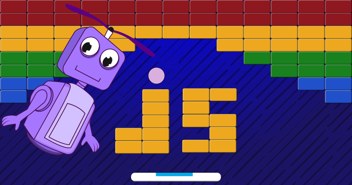

Breakout is a classic arcade video game. 

The original Breakout game was developed and published by Atari back in 1976. The game was an instant hit and inspired countless of clones on all generations of computers.

In this tutorial you’ll learn how to recreate this game that will offer you and your friends hours of entertainment.
 
## Source code 
The JavaScript source code of this program can be found [here](sketches/program.js). To run it, you need to import it in the [codeguppy.com](https://codeguppy.com) online editor. Alternatively, you can use the source code in your p5.js sketches (advanced use). 
## Online version 
To see the code running, check the online playground at [https://codeguppy.com/code.html?t=breakout](https://codeguppy.com/code.html?t=breakout) 
## Next steps 
Please check [codeguppy.com](https://codeguppy.com) for many other fun JavaScript programs and games for beginners. To stay up to date with CodeGuppy development please follow [@codeguppy](https://twitter.com/codeguppy) on Twitter.  
